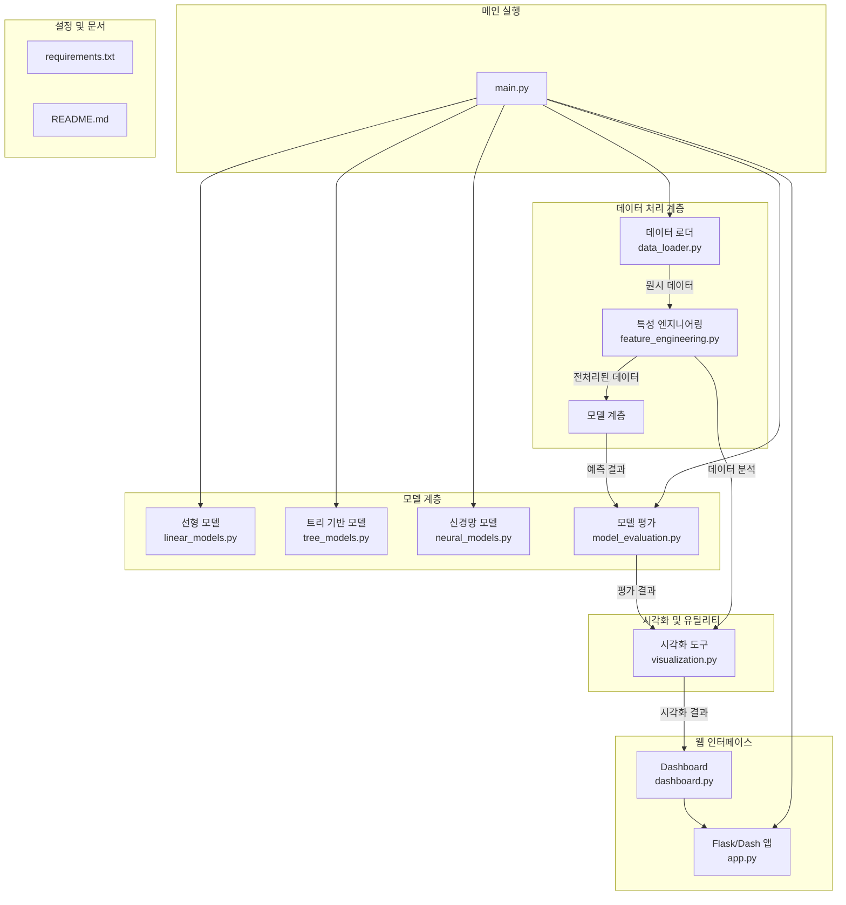

# 고급 자산 가격 변동 분석 프로젝트 구조

## 프로젝트 구조 다이어그램

## 컴포넌트 설명

### 데이터 처리 계층
- **데이터 로더 (data_loader.py)**: Yahoo Finance API를 통해 주식 데이터를 가져오고 기본적인 전처리를 수행합니다.
- **특성 엔지니어링 (feature_engineering.py)**: 기술적 지표, 시간 특성, 시차 특성 등을 계산하여 모델 입력을 준비합니다.

### 모델 계층
- **선형 모델 (linear_models.py)**: 선형 회귀, Ridge, Lasso, Elastic Net 등의 선형 모델을 구현합니다.
- **트리 기반 모델 (tree_models.py)**: 랜덤 포레스트, XGBoost, LightGBM 등의 트리 기반 모델을 구현합니다.
- **신경망 모델 (neural_models.py)**: LSTM, GRU, CNN-LSTM 하이브리드 등의 신경망 모델을 구현합니다.
- **모델 평가 (model_evaluation.py)**: 다양한 성능 지표를 계산하고 모델을 비교하는 기능을 제공합니다.

### 시각화 및 유틸리티
- **시각화 도구 (visualization.py)**: 주가 차트, 기술적 지표, 상관관계 매트릭스, 수익률 분석 등의 시각화 기능을 제공합니다.

### 웹 인터페이스
- **Flask/Dash 앱 (app.py)**: 웹 기반 대시보드를 제공하는 Flask/Dash 애플리케이션입니다.
- **Dashboard (dashboard.py)**: 대시보드 레이아웃과 컴포넌트를 정의합니다.

### 메인 실행
- **main.py**: 전체 파이프라인을 실행하는 메인 스크립트입니다.

### 설정 및 문서
- **requirements.txt**: 필요한 패키지 목록을 관리합니다.
- **README.md**: 프로젝트 설명 및 사용 방법을 제공합니다.

## 데이터 흐름

1. 데이터 로더가 Yahoo Finance API를 통해 주식 데이터를 가져옵니다.
2. 특성 엔지니어링 모듈이 데이터를 전처리하고 특성을 생성합니다.
3. 다양한 모델이 전처리된 데이터를 학습하고 예측을 수행합니다.
4. 모델 평가 모듈이 예측 결과를 평가하고 비교합니다.
5. 시각화 도구가 데이터와 결과를 시각화합니다.
6. 웹 인터페이스가 시각화 결과를 대시보드로 제공합니다. 